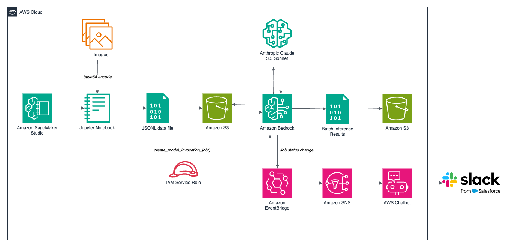

# Multimodal Batch Inference on Amazon Bedrock with Anthropic Claude 3.5 Sonnet

Explore Amazon Bedrock’s batch inference capabilities with multimodal models like Anthropic Claude 3.5 Sonnet to generate cost-effective bulk image titles, descriptions, and keywords.



## Bedrock Batch Inference IAM Permissions

See the AWS [documentation](https://docs.aws.amazon.com/bedrock/latest/userguide/batch-inference-prereq.html#batch-inference-permissions) for more details.

### IAM Policy Permissions

```json
{
  "Version": "2012-10-17",
  "Statement": [
    {
      "Sid": "PermissionsBatchInference",
      "Effect": "Allow",
      "Action": [
        "bedrock:ListFoundationModels",
        "bedrock:GetFoundationModel",
        "bedrock:TagResource",
        "bedrock:UntagResource",
        "bedrock:ListTagsForResource",
        "bedrock:CreateModelInvocationJob",
        "bedrock:GetModelInvocationJob",
        "bedrock:ListModelInvocationJobs",
        "bedrock:StopModelInvocationJob",
        "s3:ListBucket",
        "s3:GetObject",
        "s3:PutObject"
      ],
      "Resource": "*"
    }
  ]
}
```

### IAM Role Trusted Entities

See the AWS [documentation](https://docs.aws.amazon.com/bedrock/latest/userguide/monitoring-eventbridge-create-rule-ex.html) for more details.

```json
{
  "Version": "2012-10-17",
  "Statement": [
    {
      "Sid": "1",
      "Effect": "Allow",
      "Principal": {
        "Service": "bedrock.amazonaws.com"
      },
      "Action": "sts:AssumeRole",
      "Condition": {
        "StringEquals": {
          "aws:SourceAccount": "<your_account_id>"
        },
        "ArnEquals": {
          "aws:SourceArn": "arn:aws:bedrock:us-east-1:<your_account_id>:model-invocation-job/*"
        }
      }
    }
  ]
}
```

## EventBridge Rule Event Pattern

```json
{
  "source": ["aws.bedrock"],
  "detail-type": ["Batch Inference Job State Change"],
  "detail": {
    "status": ["Submitted", "Scheduled", "Stopped", "Completed", "Failed"]
  }
}
```

---

The contents of this repository represent my viewpoints and not of my past or current employers, including Amazon Web Services (AWS). All third-party libraries, modules, plugins, and SDKs are the property of their respective owners.
